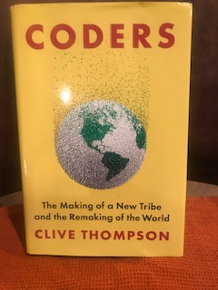

# The Beginnings of Code:

I have recently finished reading **Coders: The Making of a New Tribe and the Remaking of the World**, a book written by **Clive Thompson** *(Penguin Press 2019)*.  The book is an excellent history of the rise of programmers and the influence they have in today’s society.   

## Ladies First
The book opens with a story about a woman named Ruchi Sanghvi that worked at Facebook in the early days of the company (2006) and the ups and downs of adding a new feature to the software.   Thompson talks about Sanghvi’s history and how it was rare to see a female programmer at that time.  One of the most interesting parts of the book for me was to learn that in the *1950’s it was common for women to be programmers*.  It was said that women were well suited to be programmers because it was seen as tedious and required concentration and attention to detail – traits that many people attributed to women. This was also one of the few areas the Black women could enter.  The glamorous positions were in male dominated hardware divisions.

Some of the more interesting aspects of the book are historical backgrounds into how different generations of programmers started programming and the impact they had on the software industry.  This includes the stereotype of the lone programmer, why programming might me the meritocracy that many people believe it is, and how the number of women and minorities decreased at the same time the software industry exploded.  The software industry has many of the same problems and issues found in the broader society such as lack of women and minorities, unequal pay structures access to opportunities.  Thompson does an excellent job examining the perceptions and mind-set that hold back a lot of companies from reaching their full potential by being more inclusive.  

The author paints a detailed picture of how some of the top programmers view their craft and how they have been able to rise to the top of their profession. He gives a fascinating look into how a relatively small group of programmers and tech companies have such an overwhelming impact on the entire world.

## Privacy, please...
Clive Thompson also goes into detail about the newest topics in tech including artificial intelligence, Blockchain and crypto-currencies.  I found it very interesting that a lot of the privacy and encryption technology that we use in our everyday lives outpaced that of government agencies tasked with gathering and tracking information on various people and entities.  On the other hand, the general public has become increasingly concerned about information security and privacy. The encryption technology placed on items such as smartphones and some web browsers is unbreakable and not even the government can monitor conversations and information exchanges that use these features. This has caused conflict with the government because there is no ‘back door’ for them to use for monitoring.  Artificial intelligence and crypto-currencies are also often outside of government regulations because there are no precedents on use cases.  

---
 Clive Thompson

---

One of the recurring threads throughout Thompson’s book is that many of the top programmers are self taught.  Software is one of the few industries where all of the available tools are free and readily accessible.  This has allowed many people learn and build their own creations.  A single person with vision is indeed able to change the world. The final chapter of the book is a story about how a group of coal miners in Kentucky were re-trained as programmers after jobs became scarce in the mining industry.  The author seems to give this as an example of what the future may look like for other industries that experience massive job losses due to technological advancements.  The auto industry, oil and gas, and manufacturing might be next to require employees to acquire software and technology skills in order to stay relevant in today’s work force.

### Thumbs Up!!!
I really enjoyed this excellent book by Clive Thompson.  He is a great storyteller and provides a lot of insight about a fascinating topic.  I recommend it for anyone that is interested in a history of software and where it might be headed in the future.

---

---

